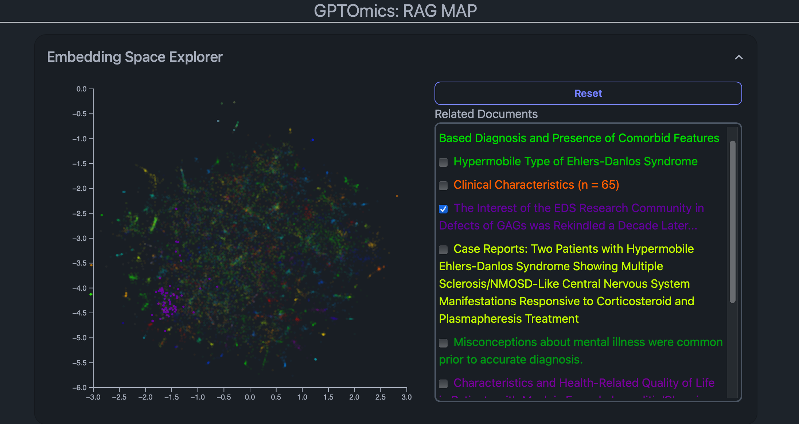
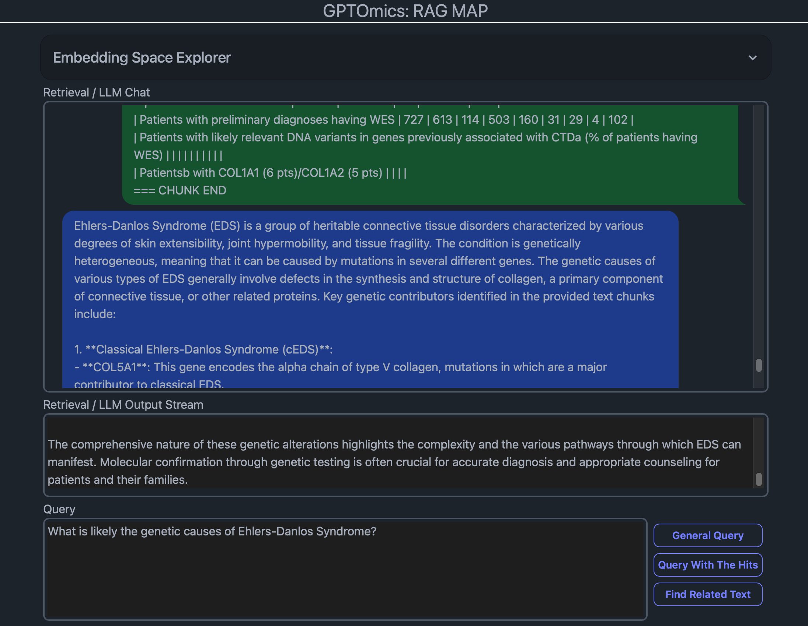

# Example: Retrieval Augmented Generation with a Map

This directory shows how to use the Tron framework for simple Retrieval Augmented Generation for a set of PDF documents.

This example takes a set of pre-computed chunks of text extracted from a set of PDF files in JSONL format with their full embedding vectors and a UMAP projection in 2 dimensions. This example demonstrates how to use the Tron framework to incorporate useful JavaScript libraries (e.g., d3.js used in this example) and compute embeddings and large language models in the backend as a service.

